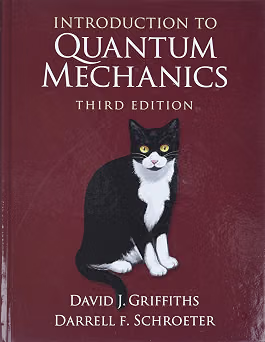
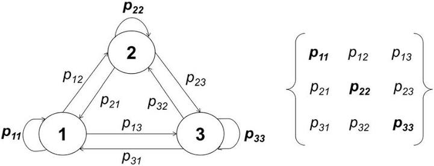
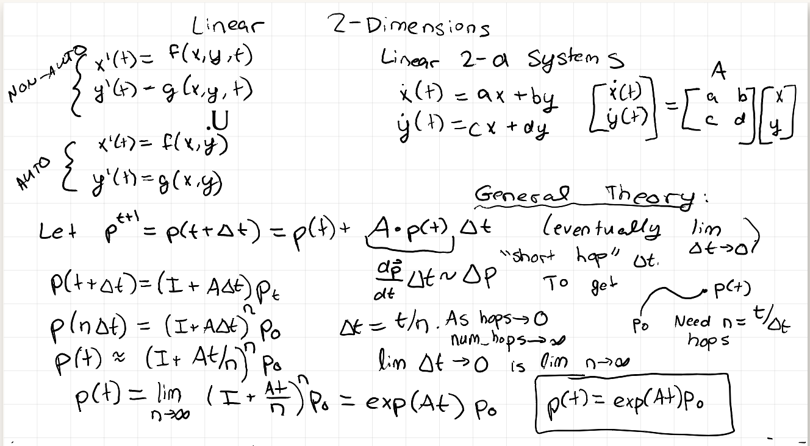
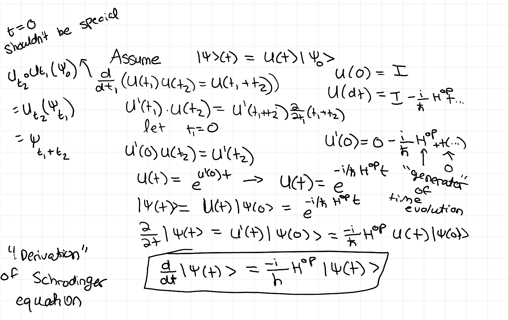

import { Columns, Column } from '../../components/notion';

> Disclaimer: this post is not very tidy. I wrote it in a straight shot in Notion at night and then did not edit it except lightly for web formatting. It does not end on a satisfying conclusion. But I want to force myself to write things like this more to develop my math and science. If nothing else, it is an ode to my COVID state. 

Now, I have COVID, which means my brain has been a bit foggy this past week. My body recovered a lot faster than my mind, which means for the last few days in particular I’ve been going kinda stir crazy, i.e. aggressively pacing around the house but still spending most of my day on Netflix. In an effort to combat this, I started doing fun mental exercise in between episodes of *Shameless*. As has been the case very recently, my poison of choice was revisiting this beautiful tome from undergrad:

*This bastard’s cat re-entered my life*

A bit into doing that, I felt I was enjoying myself a little bit too much and told myself I should do things more relevant to my career. I chose to brush up on my foundational RL theory. In the midst of all this, I realized something cool. Since the realization made me happy, I've decided to write it to incentivize random meandering and remind myself that math is awesome.

## Setup

The topic of choice was to delve into Policy Gradient Learning methods. About 30 seconds into reading [this blog post ](https://lilianweng.github.io/posts/2018-04-08-policy-gradient/)(Lilian Weng was clutch when I was learning diffusion models, so eternal trust now), I got sidetracked by the concept of the stationary distribution $d^\pi(s)$. Since I have the attention span of a goldfish, I start noodling this out on a whiteboard:

Let’s say we have 3 states $S = \{A, B, C\}$ in the classic Markov Chain state diagram. We have a three by three matrix of transition probabilities, where $p_{ij}= P(s_{t+1}=j|s_t=i)$.

Let’s collect in matrix form, i.e. $M_{ij} = p_{ij}$

$$
M := \begin{bmatrix}P(A\to A) & P(A\to B) & P(A\to C) \\P(B\to A) & P(B\to B) & P(B\to C) \\P(C\to A) & P(C\to B) & P(C\to C)\end{bmatrix}
$$

Then let our key system variable actually be $\vec{x}_t = \begin{bmatrix} P(s_t=A) \\ P(s_t=B) \\ P(s_t=C) \end{bmatrix}$. I highly recommend Future Sammy and potential current non-Sammy reader to periodically familiarize themself with what various Linear Algebra operations involving these objects means conceptually. Doing so again about a year after graduating was good for tonight’s quest to fend off Covid and Claude Code induced brainrot. Regardless, the key fact is of course that $\vec{x}_{t+1} = M^T \vec{x}_t$ and thus $\vec{x}_t = (M^T)^t \vec{x}_0$ . Defining $M$ the way I did was most intuitive to me but let’s start using $P:=M^T, x_{t+1}=Px_t$ for convenience. At first I was confused because I thought the $d^\pi(s)$ defined in the Lilian Weng blogpost was something like $d^P(\vec{x}_0)=\lim_{t \rightarrow \infty} P^t \vec{x}_0$ , i.e. given any distribution over start states we can get the long term state distribution. But very clearly they are taking about individual states $s$ and not our general system descriptor $\vec{x}$. Google indeed confirmed that it was actually: $\vec{d}^\pi= \begin{bmatrix} d^\pi(s_1) \\ d^\pi(s_2) \\ d^\pi(s_3) \end{bmatrix}$such that $P\vec{d} = \vec{d}$ so basically any equilibrium state where $x_{t'}=x_t \,\,\forall t'>t$. So why can we proceed as if $d^P(\vec{x}_0)=\lim_{t \rightarrow \infty} P^t \vec{x}_0$ not only converges, but converges to the same thing no matter what our starting condition $x_0$ is?

## The Cool Thing Part One

Notice that our stationary state $P\vec{d} = \vec{d}$ fits the exact definition of an eigenvector with eigenvalue 1. At a fuzzy level, I did recall that if you repeatedly multiply a vector by the same matrix, it tends towards the eigenvectors. But for dimensionality $N$, shouldn’t there be possibly $N$ eigenvalues and multiple eigenvectors? In our case, everything stems from the limitation that everything here are probabilities, i.e. $p_{ij}\in [0,1]$ and that the state vector $\vec x$ must add up to 1.

For any valid transition matrix $M$, as defined above, the rows must add up to one (from $A$ we must end up *somewhere*).   
This implies, $M \begin{bmatrix}1\\1\\1\end{bmatrix} = \begin{bmatrix}P(A\to A) + P(A\to B) + P(A\to C) \\ P(B\to A) + P(B\to B) + P(B\to C) \\P(C\to A) + P(C\to B) + P(C\to C)\end{bmatrix}= \begin{bmatrix}1\\1\\1\end{bmatrix}$

This guarantees that 1 is always an eigenvalue of any valid transition matrix, which at least guarantees us the existence of a stationary state $\vec{d}$.

To prove uniqueness, we can have some fun with spectral theory. Now, this is a bit hand-wavy, but we can surmise that there cannot be any eigenvalue *greater* than 1 since every entry of $M$ is a probability between zero and one. I think a proof by contradiction could show that $\nexists \vec{v} \text{ st } ||Mv||>||v||$ but I’m too lazy to figure it out. So we’ve proved the largest eigenvalue of $M$ exists and is 1.

Given this fact, we can now establish uniqueness. For any eigenvector $v_i, Mv_i=\lambda_i v_i$ and thus $M^k v = \lambda ^k v$. For any arbitrary $\vec{x}=\sum_{i =0}^N c_i \cdot v_i$, $M^k x = \sum_i c_i \lambda_i^kv_i$. All the terms with lambda less than 1 go to zero in the limit. Now, this assumes that the eigenvectors span a full basis. I cannot think of how to reproduce the same result without assuming that.

## The Cool Thing Part Two: Physics Alarm Bells

Now, every single thing about what just happened in part one was ringing alarm bells to me about something I learned in Dynamical Systems, specifically exponentiating a matrix.

$$
\exp(At)=I+At+\dfrac{A^2t^2}{2!} + \dfrac{A^3t^3}{3!} + ...
$$

Now, the difference here is that we are not accumulating past terms, i.e. $x_t=A^t x_0$ has no direct inclusion of previous timesteps $t'<t$ as well as no real form of coefficients or discounting. Dug through my old notes a bit and found:

The crucial difference here is whether the ***transition matrix defines the differential or the state itself***. In the dynamical systems case, we accumulate $\Delta x$ by applying our matrix to our state. The addition of the identity matrix in our $(I + A\Delta t)$ means that, to track where we are after infinite tiny hops, we need those missing accumulation terms that eventually become our exponentiation.

<Columns cols={2}>

<Column>

$$
x_{t+1}=Px_t\newline x_t=P^t\cdot x_0
$$

</Column>

<Column>

$$
\dfrac{dx}{dt}= Ax \newline x(t+\Delta t) \approx (I+A\Delta t)\cdot x(t) \newline x(t) = e^{A t} x(0)
$$

</Column>

</Columns>

Another way to look at this difference is that exponentiation becomes required when we transition from a **discrete time evolution** to a **continuous one.** In fact, if we supposed the underlying probability dynamics were actually continuous with our time index sampling an interval $\Delta T$, then we could connect $P = e^{A \Delta t}$ and $P^n=e^{A\Delta t \cdot n}=e^{At}$

Now the real alarm bell this was ringing was related to that quantum mechanics review I mentioned I was doing right before that. Now state evolution in quantum mechanics follows:

$$
\lvert\psi(t)\rangle = e^{-iHt/\hbar}\lvert\psi(0)\rangle
$$

which we “derived” in class using the simple assumption that time evolution arose from some time-dependent operator $U$ i.e. assume that $\lvert\psi(t)\rangle = U(t)\lvert\psi(0)\rangle$. Only restriction on $U$ is that, for probability to be maintained, it must be unitary, i.e $U^\dagger U = I$

*Notes from freshman year of college, quite nostalgic*

Now the part that wasn’t explained to us is where exactly the expression

$U(dt)=I-\dfrac{i}{\hbar}H^{op}dt + O(dt^2)$ came from , but I specifically remember $H^{op}$ here is something called the “generator of time evolution”.

Now I had to consult ChatGPT here, because I couldn’t actually tease this part out by myself. Will link resources below that explain this better, but for now, I grant you this: [https://chatgpt.com/share/6a9f6050-bb08-83ea-968d-b98374f0575e](https://chatgpt.com/share/6a9f6050-bb08-83ea-968d-b98374f0575e). I might come back another day to understand this all more deeply, but for now:

- Given the generator for the infinitesmal change $dx$, exponentiation of that generator yields our generic state evolution operator.
- The quantum case is when time evolution comes from a **Hermitian** **operator** matrix, i.e. the conjugate transpose is the inverse. This is not true for our transition matrix $M_{ij}=p(s_i \rightarrow s_j)$, which follows different probability induced constraints that induce **stochastic evolution**
- I am intrigued by the way, this could have been the motivation behind energy-based models and Boltzmann distributions in machine learning, a topic I am not super well versed in. Initially, this seems different because I don't see how the stationary probability distribution $\pi$ relates to the energy eigenfunctions in quantum. If such a connection arose, that would be very cool.

Okay, I no longer know if this post makes sense, but its 3am so saving the rest for tomorrow. This was fun! I might start making more incoherent blog posts like this on random things that I'm checking out.
